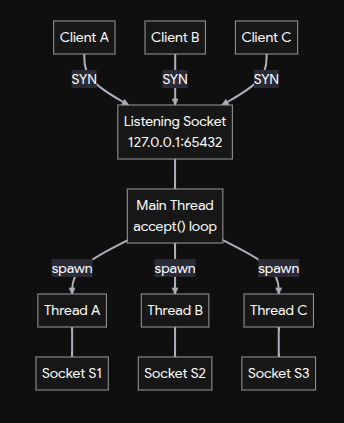
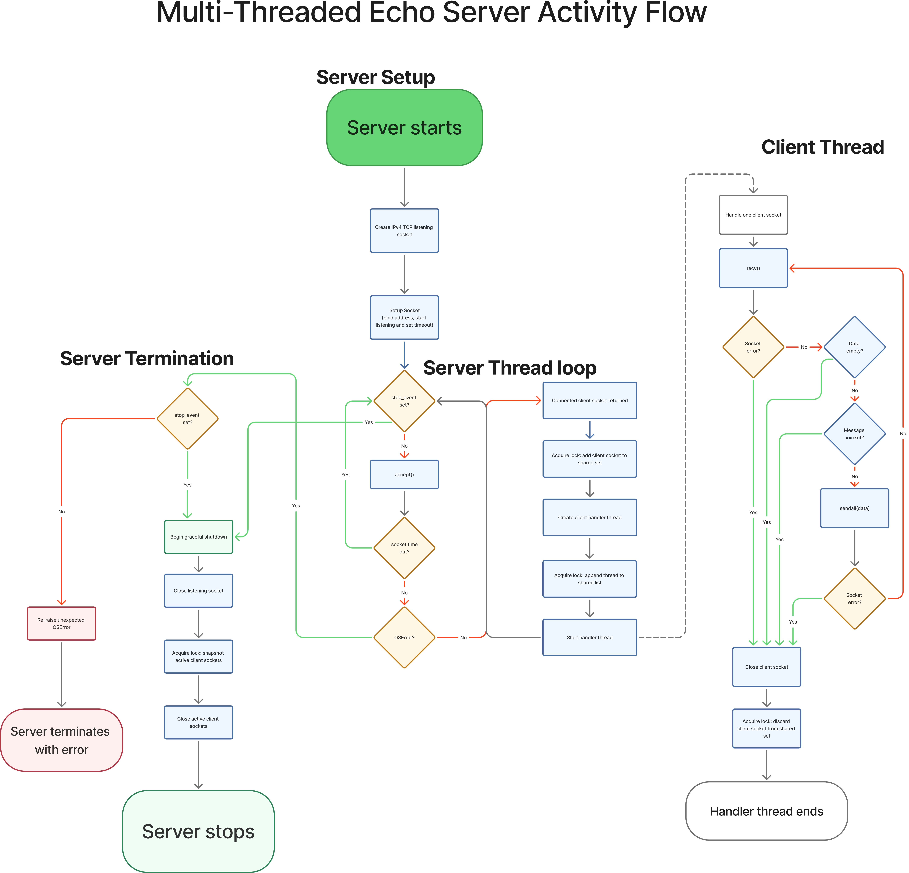
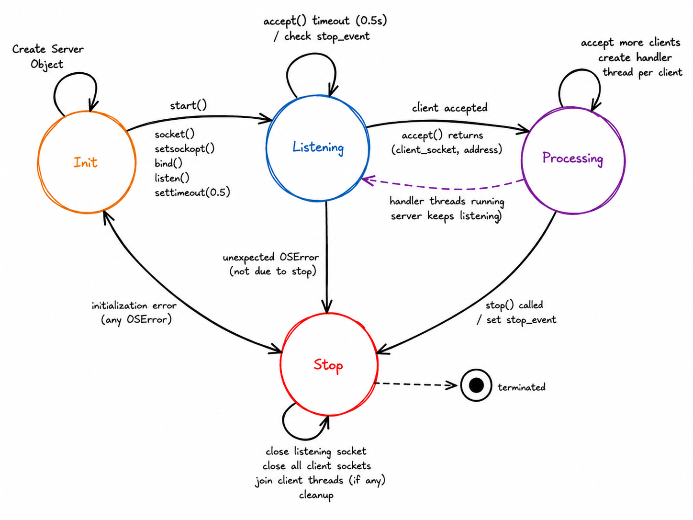

# Task 1 — Multi-threaded Echo Server & Client

A TCP echo server that accepts multiple concurrent clients using a thread-per-connection
model.


## System Design

### 1- System Architecture

- This project implements a basic TCP echo server in Python. The server accepts client
connections, echoes received messages back to the sender, and supports clean client
and server shutdown.

- It uses **thread-per-connection** as each accepted client is handled by a dedicated
thread.

<p align="center">
  
</p>

<p align="center">
  <em>
    The architecture of the server listener/accept loop hands each connection to its own handler thread
  </em>
</p>


### 2- Server Activity Diagram

Follow along with the diagram below — it shows exactly the sequence of:
- server start and setup
- server loop on client connections
- server accepts client connection and spawns a handler thread
- server termination senarios 
- **empowered with [error handling - operating on locks - updating a shared resource]**




### 3- Server State Machine

The server follows a simple four-state lifecycle: **Init**, **Listening**, **Processing**, and **Stop**.

* **Init** — Creates and configures the TCP socket
* **Listening** — Waits for incoming client connections using `accept()`. (A timeout allows the server to periodically check whether shutdown has been requested).
* **Processing** — After accepting a client, the server creates a dedicated handler thread for that connection and continues accepting additional clients. Client connections are handled independently and concurrently.
* **Stop** — Triggered when the server is requested to shut down or encounters an unrecoverable error.



## Features

- Echoes text messages back to the sending client
- Handles multiple concurrent clients using threads
- Graceful client disconnect handling and server shutdown
- Minimal dependencies — only the Python standard library required

## Quickstart
**1. Start the server** (workspace root, one terminal):
```bash
python3 src/server.py
```

**2. Start one or more clients** (separate terminals, to simulate multiple concurrent
connections — each spawns its own handler thread on the server, as shown above):
```bash
python3 src/client.py
```

**3. Chat with the server.** In the client terminal, type a message and press Enter — the
server echoes it back. Type `exit` to disconnect that client only; other
connected clients and the server keep running.

## Design Notes

- Thread-per-connection: each accepted client connection is handled by a dedicated
  thread — the "Handler thread" box in the architecture diagram above. Easy to
  implement and reason about, but does not scale to very large numbers of
  simultaneous clients 

- For higher concurrency, swap the accept loop for `selectors`, `asyncio`, or a
  ***bounded worker pool***, so the architecture diagram's shape stays the same, only how the listener dispatches work changes.

