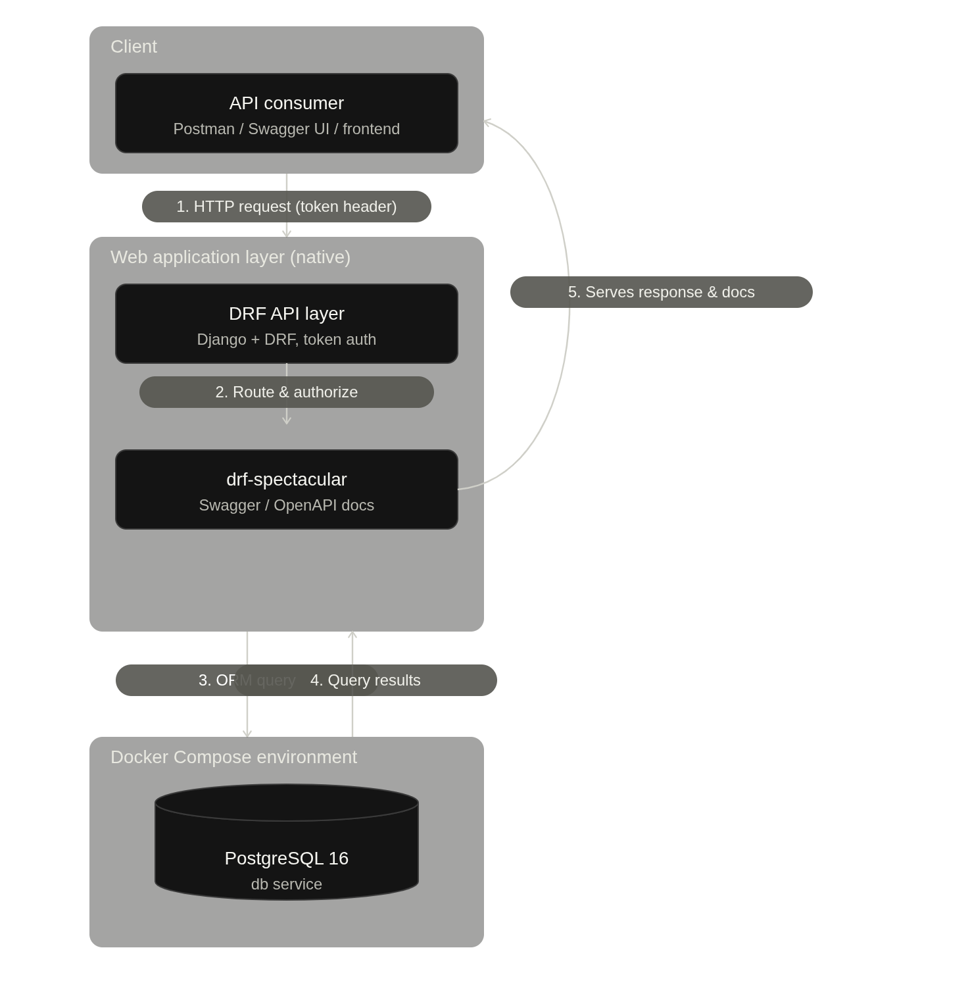
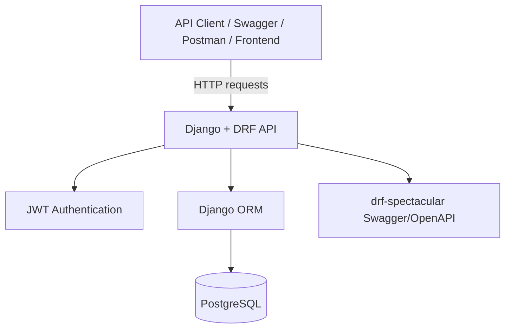
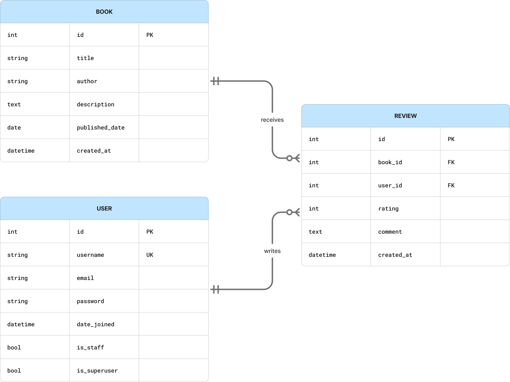
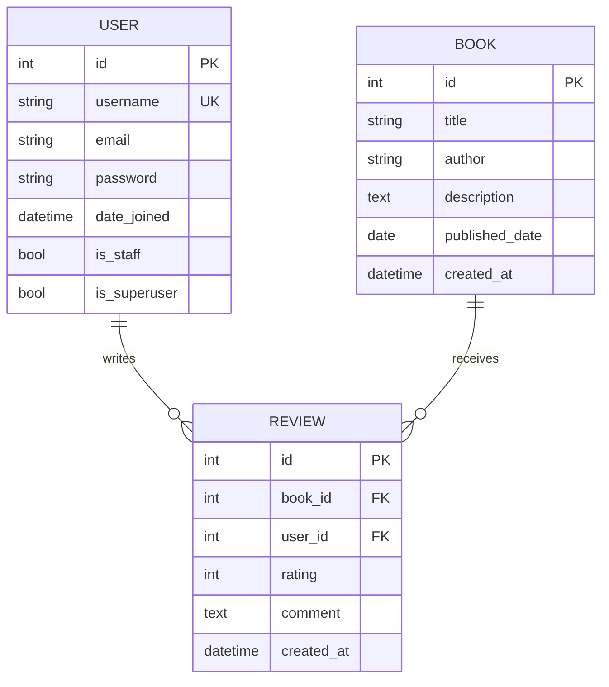
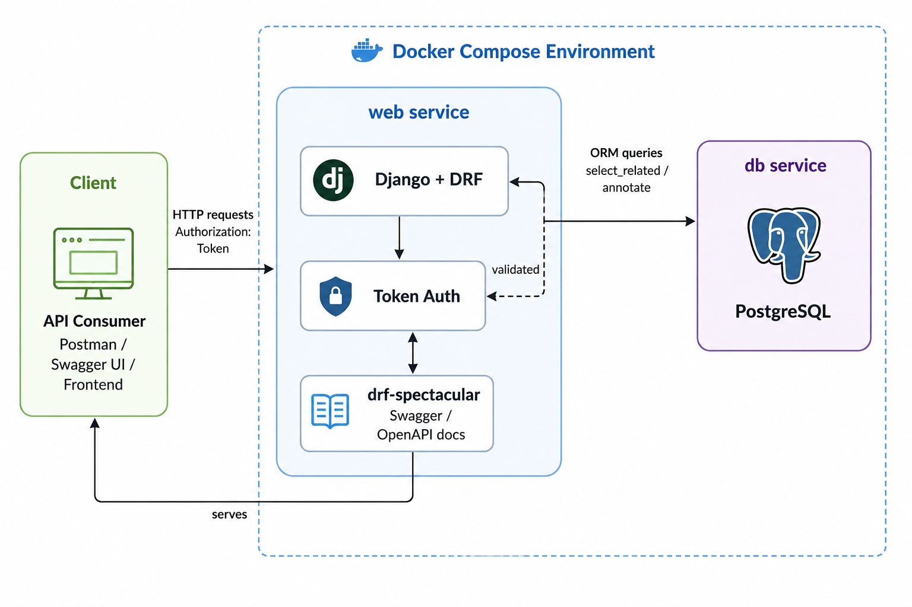
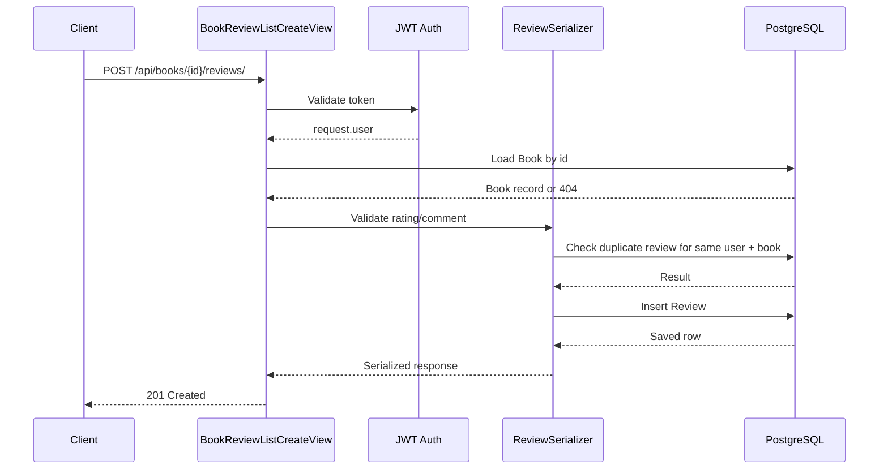

# Online Bookstore API

A Django REST Framework backend for managing books, reviews, and authenticated user interactions in a bookstore application.

## 1. Overview

This project provides a lightweight API where users can:

- register and log in,
- browse books,
- view book details with aggregated review data,
- leave at most one review per book,
- access protected endpoints through JWT authentication.

The system is intentionally small and focused, but it includes production-conscious patterns such as authentication, validation, pagination, filtering, custom logging, and DRF schema generation.

## 2. Core Features

- JWT-based authentication for API access
- Book listing with search, ordering, filtering, and pagination
- Book detail endpoint with aggregated rating data
- Review creation and listing per book
- One-review-per-user-per-book business rule
- Model validation for required fields and domain constraints
- PostgreSQL database via Docker Compose
- OpenAPI/Swagger documentation
- Admin panel for data management

## 3. System Architecture

### 3.1 High-level architecture

<!--  -->



### 3.2 Entity relationship model

<!--  -->




## 4. Business Rules and Assumptions

The project enforces these rules:

- a user can submit only one review per book,
- publication date cannot be in the future,
- rating must be between 1 and 5,
- text fields must meet validation and length constraints,
- protected endpoints require authentication.

These rules are enforced in the model and serializer layers and are covered by tests.

## 5. Project Structure

```text
backend-assessment-pm/
└── task2-DRF-book-store/
    ├── books/
    │   ├── management/commands/
    │   │   ├── seed_books.py
    │   ├── migrations/
    │   ├── tests/
    │   ├── admin.py
    │   ├── models.py
    │   ├── serializers.py
    │   ├── urls.py
    │   └── views.py
    ├── config/
    │   ├── pagination.py
    │   ├── settings.py
    │   ├── urls.py
    │   └── wsgi.py
    ├── users/
    │   ├── management/commands/
    │   │   └── create_default_admin.py
    │   ├── tests/
    │   ├── urls.py
    │   └── views.py
    ├── Dockerfile
    ├── docker-compose.yml
    ├── requirements.txt
    ├── start.sh
    ├── manage.py
    └── README.md
```

## 6. Prerequisites

- Docker
- Docker Compose
- Python 3.12+
- Optional: uv for faster dependency installation

## 7. Quick Start

### Option A: Use the automated setup script

```bash
cd task2-DRF-book-store
chmod +x start.sh
./start.sh
```

This script does the following:

- cleans up any stale port 8000 process,
- creates a local virtual environment if needed,
- installs dependencies using uv when available, otherwise pip,
- starts PostgreSQL via Docker Compose,
- runs migrations,
- creates the default admin user,
- seeds sample books,
- starts the Django backend on port 8000.

### Option B: Run manually

```bash
git clone <repo>
cd task2-DRF-book-store
python3 -m venv .venv
source .venv/bin/activate
pip install -r requirements.txt
docker-compose up -d
python manage.py migrate
python manage.py create_default_admin
python manage.py seed_books
python manage.py runserver
```

If you prefer to run the Django app in a container instead of on the host, the optional `web` service in `docker-compose.yml` can be uncommented and used with the included `Dockerfile`.

## 8. Environment and Configuration

The app reads configuration from environment variables and keeps database settings in `.env` for local development.

Key settings include:

- Django secret key
- debug flag
- allowed hosts
- PostgreSQL database settings


The project uses a hybrid local setup: PostgreSQL runs in Docker Compose, while the Django backend runs natively on the host for faster iteration and simpler local debugging.

During local development, the Django server runs with `python manage.py runserver` on the host, while PostgreSQL remains in Docker for consistency and quick teardown. This keeps the workflow responsive while preserving the production-like database service.

> The setup in the image below was intentionally simplified from a full-container approach. Keeping only the database in Docker reduces rebuild time during development, speeds up restart/reload cycles, and makes the project easier to review and test without waiting for the backend image to rebuild on every code change.
>
> A commented-out `web` service remains in `docker-compose.yml` for anyone who prefers a fully containerized deployment. In that case, the backend can be started with the same project configuration inside Docker.

<p align="center">
  
</p>

<p align="center">
  <em>
    The alternative architecture of the system.
  </em>
</p>


## 9. API Endpoints

### Authentication

- `POST /api/register/` — register a new user
- `POST /api/login/` — login and receive a JWT token
- `POST /api/token/` — obtain JWT pair
- `POST /api/token/refresh/` — refresh JWT token

### Books

- `GET /api/books/` — list books with search, ordering, filtering, and pagination
- `GET /api/books/<id>/` — fetch details for one book including rating stats

### Reviews

- `GET /api/books/<id>/reviews/` — list reviews for a book
- `POST /api/books/<id>/reviews/` — create a review for the current authenticated user

#### Request flow example - create a review 

<!--  -->




## 10. API Documentation

The project exposes OpenAPI/Swagger documentation through drf-spectacular.

Available URLs:

- `/api/schema/` — raw OpenAPI schema
- `/api/schema/swagger-ui/` — Swagger UI interface
- `/api/schema/redoc/` — Redoc documentation interface

This is configured in `config/urls.py`.

## 11. Admin Panel

Django admin is available at:

- `/admin/`

This allows administrators to manage:

- users,
- books,
- reviews,
- and app data through the built-in admin interface.

The project includes a default admin creation command:

```bash
python manage.py create_default_admin
```

## 12. Error Handling

The API uses REST-style responses for errors and validation issues:

- 400 Bad Request for invalid payloads or duplicates
- 401 Unauthorized for unauthenticated access
- 404 Not Found when a requested book or related resource does not exist

Examples from the implementation:

- invalid login returns a generic credentials error,
- duplicate review attempt is rejected with a validation error,
- invalid registration data returns a 400 response,
- missing or invalid book IDs return 404 through the standard DRF retrieval flow.

## 13. Logging and Observability

The project configures basic console logging in `config/settings.py`.

Logging is used to record:

- general request activity,
- view access for books and reviews,
- user actions such as review creation,
- authentication and validation-related events.

This gives a simple audit trail suitable for local development and debugging.

## 14. Query Performance Notes

The API has been designed with a few performance-conscious patterns:

- `BookListView.get_queryset()` uses `only()` to fetch only the fields needed for list responses.
- `BookReviewListCreateView.get_queryset()` uses `select_related("book", "user")` to reduce query overhead.
- `BookDetailView.get_queryset()` uses `annotate()` to calculate `average_rating` and `review_count` in the database instead of in Python.
- Pagination is applied by default to list endpoints to reduce payload size and improve response times.

## 15. Testing

The project includes model and API tests covering the main contract.

### Model tests cover

- required field validation,
- max-length validation,
- date validation,
- future-date prevention,
- auto-generated timestamps,
- review uniqueness.

### API tests cover

- authentication requirements,
- book listing behavior,
- search and ordering,
- pagination,
- filtering,
- book detail responses,
- review creation validation,
- duplicate review rejection,
- response status codes and expected payload content.

Run tests for each app:

```bash
# Books app tests
pytest books/tests -q

# Users app tests
pytest users/tests -q
```

Run the full project test suite:

```bash
pytest
```

You can also check coverage for a specific app:

```bash
pytest --cov=books --cov-report=term-missing
```

Or for the full project:

```bash
pytest --cov=. --cov-report=term-missing
```

## 16. Security

This project applies a solid baseline of Django and DRF security controls to protect users and restrict access to sensitive API endpoints.

### Implemented protections

- Protected endpoints require authentication using DRF IsAuthenticated permissions.
- JWT-based authentication is enabled through Django REST Framework SimpleJWT.
- Passwords are stored securely using Django’s built-in password hashing.
- Usernames are checked for uniqueness during registration.
- Model validation prevents invalid or unsafe input, including:
  - empty required fields,
  - overlong text values,
  - invalid numerical ranges,
  - logically invalid dates (future publication dates),
- Secrets are managed through environment variables instead of hardcoded values.

### Django / DRF protections included by default

- ORM-based queries help prevent SQL injection.
- DRF serializer validation reduces malformed input.
- CSRF protection is available for Django web flows.
- Clickjacking protection is enabled via Django middleware.

### Recommended improvements

To harden the application for production, the following should be added next:

- enforce HTTPS and secure HTTP headers,
- add API rate limiting / request throttling,
- restrict ALLOWED_HOSTS and CORS properly,
- secure the admin interface with MFA and restricted access,
- secure secret management outside local `.env` files using a secret manager service (i.e. AWS SeretManager) or GitHub secrets
